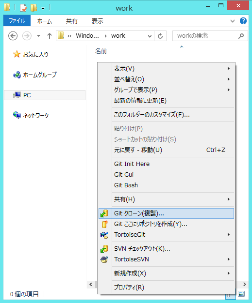
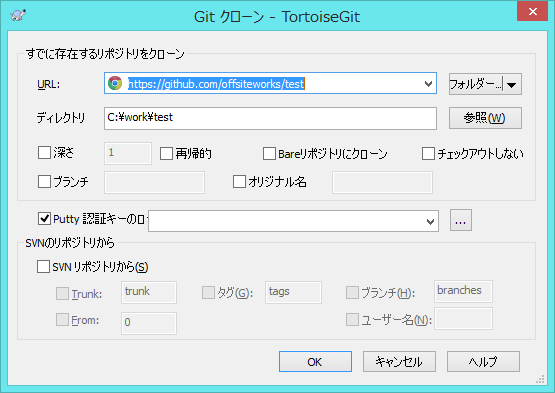

Git チュートリアル - Git 学習用資料
============

マニュアルを書こうかとも思いましたが、
Webサイトに同じ様なものがあるので
以下のもので代用したいと思います。
資料化は別途考えましょう。

ツールとしては [GitHub for Windows](https://windows.github.com) は英語版しか無いので
日本語版の言語設定のある TortoiseGit を使う事にします。

Git入門、Gitとは何かがわかる様な内容が以下のURLに書かれています。

## [Git入門](http://www.backlog.jp/git-guide/)

+ 入門編 - 1. Gitの基本 
+ [1.1 Gitを使ったバージョン管理](http://www.backlog.jp/git-guide/intro/intro1_1.html)
+ [1.2 履歴を管理するリポジトリ](http://www.backlog.jp/git-guide/intro/intro1_2.html)
+ [1.3 変更を記録するコミット](http://www.backlog.jp/git-guide/intro/intro1_3.html)
+ [1.4 ワークツリーとインデックス](http://www.backlog.jp/git-guide/intro/intro1_4.html)

## Git関連ツール(msysgitとTortoiseGit)のインストール

+ [2.1 Git関連ツール(msysgitとTortoiseGit)のインストール](http://www.backlog.jp/git-guide/intro/intro2_1.html)
+ [2.2 初期設定](http://www.backlog.jp/git-guide/intro/intro2_2.html)

ツールのインストと初期設定までをお願いします。
リポジトリの作成は、後回しにします。

## 練習用テストリポジトリのクローン

練習用テストリポジトリのクローンからやりましょう。
ローカルPCにどこでもいいのでGitワークフォルダとして空のフォルダを作成してください。

`C:\work` でも結構です。

右クリック → Git クローン(複製)... 

以下の画面でURLとして https://github.com/offsiteworks/test を入力してください。

★作成中★ とりあえずここまで

## コミット★未作成★

## リモートリポジトリへのプッシュ★未作成★
